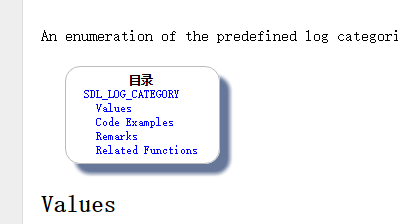
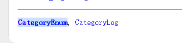

SDL2 文档翻译说明
==============================
1. 统一采用Markdownw文件编码格式,不会请参考 [Markdown入门指南](http://www.jianshu.com/p/1e402922ee32/)
2. 翻译规范 
    1. 命名文件，以及放的位置
        文件名统一用列出的标题命名，如我要翻译文档`SDL_AddEventWatch`,文件命名则为`SDL_AddEventWatch.md`   
        文件放的位置为 类别/文件名 其中类别有 `Hints`,`Enumerations`,`Structures`,`Functions`,对应相应文件夹中
    2. 翻译标记
        在翻译文档时，请在[List.md](List.md) 的相应列后面加 `translating by ID 时间`，如：
```

 - [ ] Functions
    - [ ] SDL_AddEventWatch translating by DXkite 2016-09-18  

```
        然后提交到本GIT库中，不会使用git库的，请联系 @DXkite 或者查看[Github 简明教程](http://www.runoob.com/w3cnote/git-guide.html)学习，
        翻译完成后，请将`[ ]`改为`[x]`，标识该文档已经翻译，并添加文件链接,可修改日期,如
```

- [x] Functions
	 - [x] [SDL_AddEventWatch](Functions/SDL_AddEventWatch.md) translated by DXkite 2016-09-19

```
    3. 文件链接
        如链接 `See SDL_LogPriority for details` 其中 `SDL_LogPriority` 为链接`http://wiki.libsdl.org/SDL_LogPriority`，找到其对应位置，
        用 `[SDL_LogPriority](MD路径)` 来表示，该例子的实例：`See [SDL_LogPriority](Functions/SDL_LogPriority.md) for details` -> See [SDL_LogPriority](Functions/SDL_LogPriority.md) for details
    4. 类别和分类目录之类的东西不需要翻译，如图：    
        
        
    5. 作者标记
        在文本开头加入 `Translate By 作者`
    6. Markdown 目录标记
        用 `#`,`##`,`###`来标识一二三级标题
    7. 文章暂时发布在[ATD-Library](http://library.atd3.cn)上，由管理员上传，请管理员申请账号，找群主申请编辑权限
3. 加入翻译组 
    点击链接加入群 [ATD-翻译组](http://jq.qq.com/?_wv=1027&k=29rZUY1)
